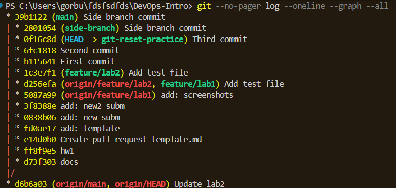
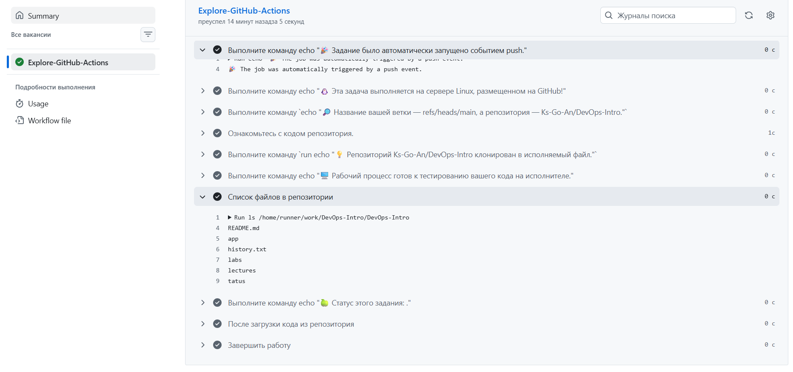
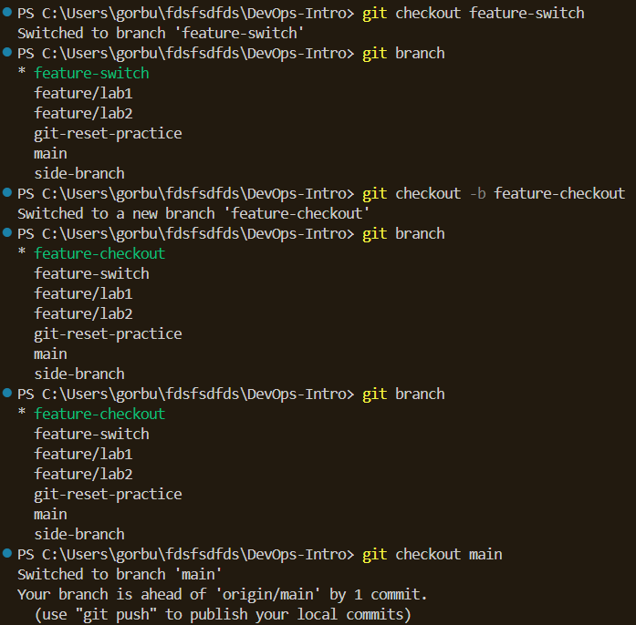
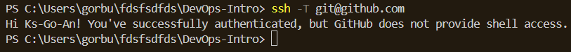
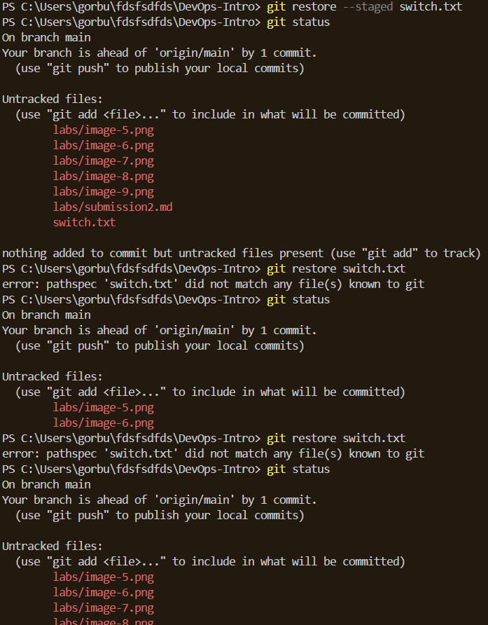
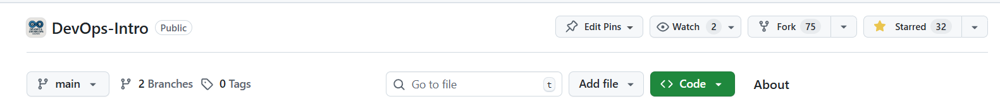
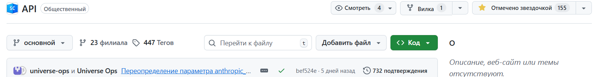
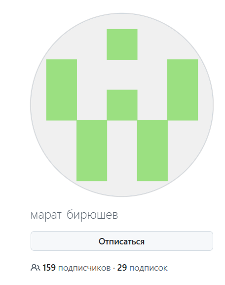

## Задание 1 
СМОТРИМ ПОСЛЕДНИЙ КОММИТ:
PS C:\Users\gorbu\fdsfsdfds\DevOps-Intro> git log --oneline -1
1c3e7f1 (HEAD -> feature/lab2) Add test file

НАХОЖУ ХЕШИ:
PS C:\Users\gorbu\fdsfsdfds\DevOps-Intro> git cat-file -p HEAD
tree 18cb1762057455836abf44cc0094f1bb5e3f39f9
parent d256efae6eb0b89f0216d334001da7d274386036
author Ks-Go-An <k.gorbushina@innopolis.university> 1770835969 +0300
committer Ks-Go-An <k.gorbushina@innopolis.university> 1770835969 +0300

TREE:
PS C:\Users\gorbu\fdsfsdfds\DevOps-Intro> git cat-file -p 18cb1762057455836abf44cc0094f1bb5e3f39f9
040000 tree 944f6277b3ee76150c823490e6f1645af583e065    .github
100644 blob 6e60bebec0724892a7c82c52183d0a7b467cb6bb    README.md
040000 tree a1061247fd38ef2a568735939f86af7b1000f83c    app
040000 tree 7e60d691fdb7fe111169dc582f4e87a9958abf20    labs
040000 tree d3fb3722b7a867a83efde73c57c49b5ab3e62c63    lectures
100644 blob 355cb877ccaf344af9509b40c40cc5b8d3b15d5f    tatus
100644 blob 418a98ced2ac70b5bdee0be9732ecdaae7264515    test.txt
100644 blob 418a98ced2ac70b5bdee0be9732ecdaae7264515    test2.txt

BLOB:
PS C:\Users\gorbu\fdsfsdfds\DevOps-Intro> git cat-file -p 418a98ced2ac70b5bdee0be9732ecdaae7264515
��Test content

ещё TREE:
PS C:\Users\gorbu\fdsfsdfds\DevOps-Intro> git cat-file -p d3fb3722b7a867a83efde73c57c49b5ab3e62c63
100644 blob 304628578f83a142e37ad867c4d94e0dfe3797de    lec1.md
100644 blob 64f9e085fbb95be838e601892d4256abfd6af531    lec10.md
100644 blob c4f16b6b7ad4b9c00970949aba60b8d26aae656f    lec2.md
100644 blob 337a6f9942f26e6f9af8f43df1002ae0f81bd8cd    lec3.md
100644 blob 2ea920c25870fea38a0e2ea32ddab07e49e6de87    lec4.md
100644 blob 6cabcd14a9b3ee16f766374930d0c56a5309c7b5    lec5.md
100644 blob 35fb9286df34822e1922830d105ddd8b2359e9b2    lec6.md
100644 blob f1ad42a6761aa26378017aec45fdebc101bb6378    lec7.md
100644 blob 558dbe10aca2cb80f8fe404c9cc559b555a19f65    lec8.md
100644 blob eec68024f511b34a9ae558c51af8743be095e8ff    lec9.md
100644 blob 418a98ced2ac70b5bdee0be9732ecdaae7264515    test.txt
100644 blob 418a98ced2ac70b5bdee0be9732ecdaae7264515    test2.txt

ещё BLOB:
PS C:\Users\gorbu\fdsfsdfds\DevOps-Intro> git cat-file -p 418a98ced2ac70b5bdee0be9732ecdaae7264515
��Test content

Blob — хранит содержимое файла, не содержит информации об имени файла или правах доступа

Tree — похоже на оглавление, в котором имена файлов, права доступа и ссылки на соответствующие blob или на другие tree (для вложенных папок)

Commit — слепок состояния репозитория в определённый момент: ссылка на корневое дерево, автор, дата, комментарий и ссылка на предыдущий коммит

Git хранит все объекты в папке .git/objects. Если содержимое объекта не меняется, его хеш остаётся тем же, и Git не создаёт новый объект, а переиспользует старый. Именно поэтому система очень экономит место: неизменённые файлы между коммитами не копируются, деревья тоже переиспользуются, а коммиты хранят только ссылки и метаданные. Такой подход делает работу с историей быстрой, позволяет мгновенно переключаться между версиями.

Пример содержимого объектов можно посмотреть выше, где я демонстрировала команды и выводы в терминале

## Задание 2

# ПОДГОТОВКА:
PS C:\Users\gorbu\fdsfsdfds\DevOps-Intro> echo "First commit" > file.txt
PS C:\Users\gorbu\fdsfsdfds\DevOps-Intro> git add file.txt
PS C:\Users\gorbu\fdsfsdfds\DevOps-Intro> git commit -m "First commit"
[git-reset-practice b115641] First commit
 1 file changed, 0 insertions(+), 0 deletions(-)
 create mode 100644 file.txt
PS C:\Users\gorbu\fdsfsdfds\DevOps-Intro> echo "Second commit" >> file.txt
PS C:\Users\gorbu\fdsfsdfds\DevOps-Intro> git add file.txt
PS C:\Users\gorbu\fdsfsdfds\DevOps-Intro> git commit -m "Second commit"
[git-reset-practice 6fc1818] Second commit
 1 file changed, 0 insertions(+), 0 deletions(-)
PS C:\Users\gorbu\fdsfsdfds\DevOps-Intro> echo "Third commit" >> file.txt
PS C:\Users\gorbu\fdsfsdfds\DevOps-Intro> git add file.txt
PS C:\Users\gorbu\fdsfsdfds\DevOps-Intro> git commit -m "Third commit"
[git-reset-practice 0f16c8d] Third commit
 1 file changed, 0 insertions(+), 0 deletions(-)

# СМОТРИМ, ЧТО ФАЙЛЫ СУЩЕСТВУЮТ:
PS C:\Users\gorbu\fdsfsdfds\DevOps-Intro> git log --oneline
0f16c8d (HEAD -> git-reset-practice) Third commit
6fc1818 Second commit
b115641 First commit

# ИСПОЛЬЗУЕМ git reset --soft HEAD~1 
PS C:\Users\gorbu\fdsfsdfds\DevOps-Intro> git reset --soft HEAD~1
PS C:\Users\gorbu\fdsfsdfds\DevOps-Intro> git status
On branch git-reset-practice
Changes to be committed:
  (use "git restore --staged <file>..." to unstage)
        modified:   file.txt

Untracked files:
  (use "git add <file>..." to include in what will be committed)
        et --soft HEAD~1
        labs/image-5.png
        labs/image-6.png
        labs/image-7.png
        labs/image-8.png
        labs/submission2.md

# ВИДИМ, ЧТО Third commit БОЛЬШЕ НЕТ В ИСТОРИИ
PS C:\Users\gorbu\fdsfsdfds\DevOps-Intro> git log --oneline
6fc1818 (HEAD -> git-reset-practice) Second commit
b115641 First commit

# ВЫПОЛНЯЮ git reflog
PS C:\Users\gorbu\fdsfsdfds\DevOps-Intro> git reflog
6fc1818 (HEAD -> git-reset-practice) HEAD@{0}: reset: moving to HEAD~1
0f16c8d HEAD@{1}: commit: Third commit
6fc1818 (HEAD -> git-reset-practice) HEAD@{2}: commit: Second commit
b115641 HEAD@{3}: commit: First commit
1
# ВОЗВРАЩАЮ Third commit
PS C:\Users\gorbu\fdsfsdfds\DevOps-Intro> git reset --hard 0f16c8d       
HEAD is now at 0f16c8d Third commit

# ВЫПОЛНЯЮ git reset --hard HEAD~1
PS C:\Users\gorbu\fdsfsdfds\DevOps-Intro> git reset --hard HEAD~1
HEAD is now at 6fc1818 Second commit

# ВИДИМ ТОЛЬКО ПЕРВЫЙ И ВТОРОЙ КОММИТ
PS C:\Users\gorbu\fdsfsdfds\DevOps-Intro> cat file.txt
First commit
Second commit

# ВОЗВРАЩАЕМ
PS C:\Users\gorbu\fdsfsdfds\DevOps-Intro> git reflog
6fc1818 (HEAD -> git-reset-practice) HEAD@{0}: reset: moving to HEAD~1
0f16c8d HEAD@{1}: reset: moving to 0f16c8d
6fc1818 (HEAD -> git-reset-practice) HEAD@{2}: reset: moving to HEAD~1
0f16c8d HEAD@{3}: commit: Third commit
6fc1818 (HEAD -> git-reset-practice) HEAD@{4}: commit: Second commit
b115641 HEAD@{5}: commit: First commit

PS C:\Users\gorbu\fdsfsdfds\DevOps-Intro> git reset --hard 0f16c8d
HEAD is now at 0f16c8d Third commit

# СНОВА ТРИ КОММИТА
PS C:\Users\gorbu\fdsfsdfds\DevOps-Intro> cat file.txt
First commit
Second commit
Third commit
PS C:\Users\gorbu\fdsfsdfds\DevOps-Intro> git log --oneline
0f16c8d (HEAD -> git-reset-practice) Third commit
6fc1818 Second commit
b115641 First commit

# АНАЛИЗ
Я использовала git reflog, чтобы найти хеш удалённого третьего коммита, и выполнила git reset --hard <хеш>, полностью восстановив состояние проекта. reflog помогает отменять ошибочные сбросы

## Задание 3
граф:

Список коммитов:
Side branch commit
Side branch commit (я два раза их сделала, потому что с первого раза не разобралась)
Third commit
Second commit
First commit
Add test file
Add test file
add: screenshots
add: new2 subm
add: new subm
add: template
Create pull_request_template.md
hw1
docs
Update lab2
remove old Exam Exemption Policy
update structure
publish lecs 9 & 10
update lab7
publish lec8
introduce all labs and revised structure
publish lab and lec #5
publish labs 4&5, revise others
publish lab3 and lec3
publish lec2
publish lab2
update lab1
lab1
lec1
README.md

Размышление:
График позволяет увидеть структуру ветвления, ветка `side-branch` отделилась от `main` и содержит один дополнительный коммит. Граф мгновенно показывает отношения «родитель-потомок» и параллельные ветки.

## Задание 4

Используемые теги и команды:
git tag v1.0.0
git push origin v1.0.0

Хеши связанных коммитов:
PS C:\Users\gorbu\fdsfsdfds\DevOps-Intro> git log --oneline -1
0f16c8d (HEAD -> git-reset-practice, tag: v1.0.0) Third commit

Теги позволяют зафиксировать важные состояния репозитория — например, релизные версии. К ним можно быстро переключиться (git checkout v1.0.0), на них часто завязаны автоматические сборки и деплои в CI/CD, а также они служат основой для примечаний к релизам, упрощая версионирование и коммуникацию в команде

## Задание 5

# git switch

# git checkout

# git restore

Когда использовать:
git switch — только для переключения между ветками (создание, перемещение). Современная, понятная альтернатива checkout.

git checkout — устаревшая версия: и ветки, и файлы. Лучше заменять на switch и restore.

git restore — для работы с файлами: отмена изменений, снятие с индекса, восстановление из коммита.

## Задание 6
Сообщество GitHub
Подписки и звёзды:

Подписалась на Никиту Кириянова, Илью Прокофьева и Андрея Мусташкина

Почему важно отмечать репозитории звёздами?  
Звёзды работают как «закладки», чтобы быстро найти проект позже. Также это способ поддержать авторов, а для open-source проектов может быть важным показателем популярности и доверия. Чем больше звёзд, тем выше проект в поиске и тем больше новых пользователей его увидят 

Зачем подписываться на разработчиков? 
Подписываясь, вы можете видеть, над чем работают другие, какие инструменты они используют, в какие проекты вносят вклад. Это помогает быть в курсе трендов, учиться на чужом коде и строить профессиональные связи, что особенно важно в командных проектах и для карьерного роста