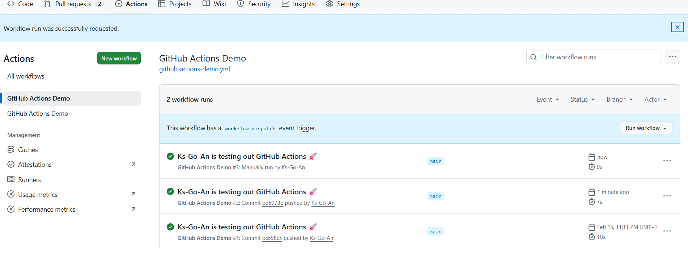
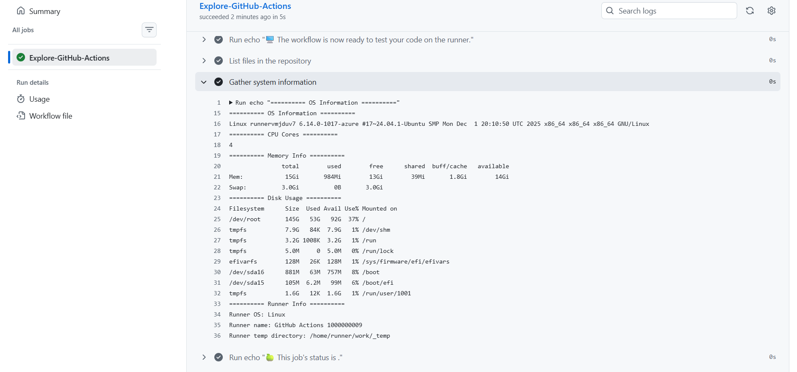

## Задание 1
# 1.1
Действовала строго по инструкции по ссылке. Перешла в репозиторий, создала файл, назвала так, как было написано в инструкции и вставила текст, который также требовала инструкция. На моменте сохранения засомневалась как именно надо сохранить, выбрала вариант остаться в той же ветке, потому что вроде уже нахожусь там, где надо и новую ветку создавать не следует. Затем проверила всё ли работает также по инструкции во вкладке "Действия", руководство очень чёткое и полностью совпадало с тем, что я видела на экране, поэтому всё прошло гладко.

# 1.2
ссылка на "Действия":
https://github.com/Ks-Go-An/DevOps-Intro/actions/runs/22042798816/job/63686407434

Основные усвоенные понятия (jobs, steps, runners, triggers):
jobs - задачи. В моём случае была одна задача с названием build
Внутри задачи выполняются steps - шаги
Все задачи крутятся на runner — это виртуальная машина
trigger - это событие, которое запускает workflow. У меня это push — как только я отправляю изменения на GitHub, сразу стартует мой workflow.

Краткое описание причин запуска этой операции:
Workflow запустился потому, что я сделал git push в ветку feature/lab3. В файле конфигурации написано on: [push], поэтому GitHub Actions следит за пушами и автоматически запускается

Анализ процесса выполнения рабочих задач:
Сначала была настройка, она описана выше
После того как я запушила код, зашла на GitHub во вкладку Действия и увидела там новый запуск с зелёной галочкой — значит всё работает. Если нажать на него, то можно увидеть все детали выполнения

## Задание 2
Я добавила `workflow_dispatch` в секцию `on` и сделала шаг `Gather system information` с командами для сбора данных о системе:

Настроила процесса диспетчеризации вручную:

Добавлен сбор системной информации:

Сравнение автоматического и ручного запуска: 
Автоматический запуск происходит при push, ручной — по кнопке в интерфейсе. Оба способа выполняют одинаковые шаги, но ручной удобен для тестирования без коммита, а автоматический при постоянной проверки кода

Анализ runner:
Runner на Ubuntu Linux, он имеет 4 ядра процессора, 15 ГБ оперативной памяти (из которых на момент выполнения было свободно около 13 ГБ) и 3 ГБ swap. Дисковое пространство на корневом разделе /dev/root составляет 145 ГБ, из которых занято 53 ГБ. Этого достаточно для стандартных задач CI/CD
Знание этих характеристик помогает оценить доступные ресурсы и избежать их перерасхода